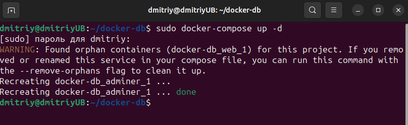
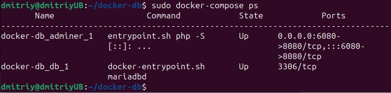
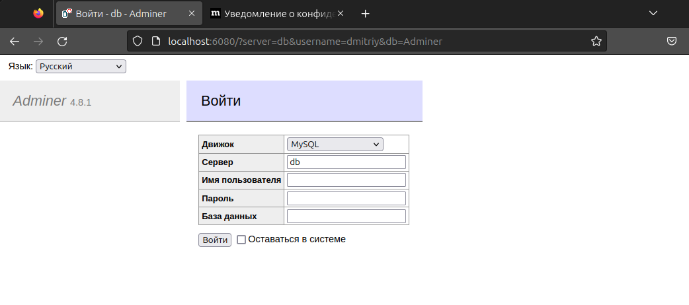

## Создать сервис, состоящий из 2 различных контейнеров: 1 - веб, 2 - БД (compose)

1. Создаём в папке yaml-файл с именем по умолчанию docker-compose.yml.

2. Создаём и запускаем проект, в фоновом режиме, без указания имени yaml-файла, т.к. он имеет имя по умолчанию.

3. Смотрим, что у нас появилось два контейнера.

4. Открываем страницу под адресом http://localhost:6080 

